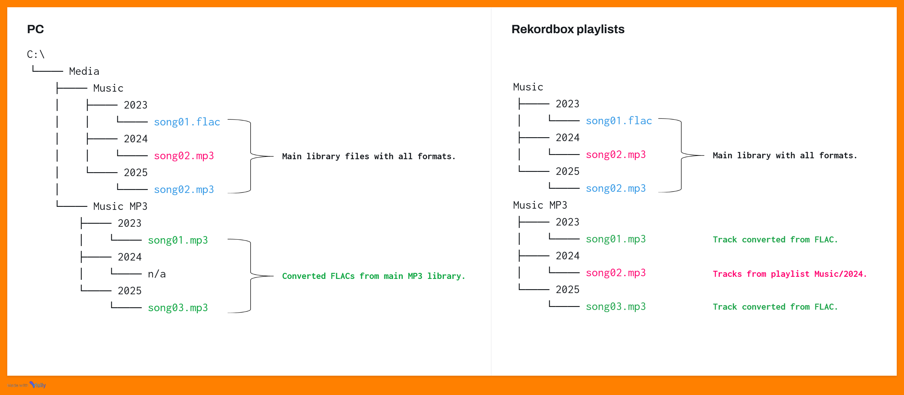

# Upozornění

MetaRekordFixer (dále jen "aplikace") je neoficiální nástroj určený pouze pro osobní použití a není produktem společnosti AlphaTeta, která je autorem software RekordboxTM. Použití aplikace je na vlastní riziko uživatele, autor v žádném případě neodpovídá za případné škody (např. ztráta či poškození dat), které si uživatel způsobí jejím používáním. Jako prevence možných negativních dopadů je před jakoukoliv uživatelem požadovanou a potvrzenou změnou provedena záloha databáze software RekordboxTM, do které aplikace přímo přistupuje.

# Proč vznikla tato aplikace?

Autorem aplikace je aktivní DJ. Klade velký důraz na správná metadata ve své hudební sbírce, protože mu to usnadňuje při jeho vystoupeních výběr skladeb. Pro využití maximálního potenciálu funkcí produktů společnosti Pioneer, které jsou dnes standardem v místech působení DJs, je takřka nutností používat software RekordboxTM. Ten však má svá omezení, a to právě v oblasti metadat. Autor není programátor, a tak díky volně dostupným zdrojům nejdříve vznikaly jednoúčelové skripty v Pythonu spouštěné v příkazovém řádku. Jak však narůstal jejich počet, stala se postupem času práce s nimi už nekomfortní. Posloužily tedy jako základ pro vznik komplexnějšího řešení, jehož hlavním úkolem je být pro **META**data v software **REKORD**box užitečným údržbářem - **FIXER**, a to v použitelném grafickém prostředí.

# Co konkrétně aplikace řeší?

Hlavní nedostatky, které autor potřeboval řešit, byly tyto:
- [Upozornění](#upozornění)
- [Proč vznikla tato aplikace?](#proč-vznikla-tato-aplikace)
- [Co konkrétně aplikace řeší?](#co-konkrétně-aplikace-řeší)
    - [1. Starší CDJ přístroje společnosti Pioneer nepodporují formát FLAC.](#1-starší-cdj-přístroje-společnosti-pioneer-nepodporují-formát-flac)
    - [2. Neukládání některých metadat u FLAC.](#2-neukládání-některých-metadat-u-flac)
    - [3. Přenos (HOT) CUEs a dalších informací.](#3-přenos-hot-cues-a-dalších-informací)
    - [4. Nemožnost změnit formát skladby.](#4-nemožnost-změnit-formát-skladby)
    - [5. CDJ neumožňuje řadit skladby dle data vydání.](#5-cdj-neumožňuje-řadit-skladby-dle-data-vydání)
    - [6. Chybí převod mezi formáty.](#6-chybí-převod-mezi-formáty)
- [Jakým způsobem aplikace pracuje](#jakým-způsobem-aplikace-pracuje)
- [Instalace](#instalace)
- [Závěrečné informace](#závěrečné-informace)

### 1. Starší CDJ přístroje společnosti Pioneer nepodporují formát FLAC.

Autor tuto situaci vyřešil tím, že každý FLAC v jeho sbírce má svojí MP3 verzi uloženou odděleně od hlavní sbírky. V úložišti má 2 hlavní složky: `Music` (hlavní sbírka obsahující FLAC a MP3) a `Music MP3` (sbírka obsahující MP3 vytvořené z FLAC ve složce `Music`). Tato složka má stejnou adresářovou strukturu, jako složka `Music`. V RekordboxuTM jsou na první úrovni (root) 2 složky : `Music` a `Music MP3`. Složka `Music` obsahuje playlisty, jejichž názvy i obsah odpovídají složkám `Music`. Složka `Music MP3` má taktéž playlisty podle složek a jejich obsahu v úložišti. Je však doplněna MP3 skladbami z hlavní sbírky (`Music`). Pak už jen stačí vyexportovat obě složky z RekordboxuTM na přenosné úložiště (USB Flash, HDD, SDD, SD karta) a v případě, že DJ má před sebou starší CD, vybírá si skladby ze složky `Music MP3`. Níže konkrétní příklad struktury souborů a playlistů pro snažší pochopení.

### 2. Neukládání některých metadat u FLAC.

rekordboxTM u FLAC souborů nezapisuje tyto údaje: datum vydání, intepret alba, název mixu, původní interpret. U MP3 souborů však tato data zapíše korektně. MetaRekordFixer toho využije tímto způsobem:
- základním předpokladem je, že v databázi RekordboxuTM jsou naimportovány MP3 ekvivalenty originálních FLAC skladeb ve stejné struktuře (viz výše)
- metadata z těchto MP3 jsou zkopírována do databáze k položkám knihovny ve formátu FLAC
*Důležité upozornění: soubory MP3 a FLAC musí mít stejný název (bez ohledu na příponu).*

### 3. Přenos (HOT) CUEs a dalších informací.

DJ si vytvořil knihovnu obsahující MP3 kopie svých FLAC skladeb pro zajištění kompatibility se staršími CDJ. Nicméně nastavení mřížek, hot cues, memory cues, počty přehrání jsou uložené jen u FLAC. Co s tím? Nikomu se jistě nechce dělat vše znovu, když ví, že ty informace někde jsou uložené, že? MetaRekordFixer tyto informace to patřičných skladeb překopíruje! V tomto případě je dokonce možné:
- nastavit, aby se data překopírovala mezi položkami výběrem zdrojové a cílové složky ve kterých jsou soubory
- nastavit, aby se data překopírovala mezi playlisty, což je užitečné v případě, že jsou skladby v různých složkách
- funguje i kombinace, že zdrojem jsou položky ve složce, cílem položky z playlistu a naopak.

*Důležité upozornění: pokud je zdroj nebo cíl soubor MP3, je nutné, aby jeho bitrate byl konstatní. Při variabilním bitrate nemusí být překopírované CUE body na správných místech.*

### 4. Nemožnost změnit formát skladby.

Autor měl ve své sbírce některé skladby v MP3 nízké kvality. Pořídil si tedy tyto stejné skladby ve FLAC formátu jako náhradu. Standardně je nutné skladby naimportovat do Rekordboxu znovu, což s sebou opět nese ztrátu CUE bodů atd. MetaRekordFixer má tuto situaci vyřešenou. Stačí si jen připravit playlist s těmi původními skladbami, které chceme nahradit a nové skladby mít v nějaké složce. Předpokladem jsou stejné názvy souborů skladeb (bez ohledu na příponu). 

### 5. CDJ neumožňuje řadit skladby dle data vydání.

CDJ produkty od společnosti Pioneer mají, jako jedno z kritérií řazení, možnost skladby řadit dle data přidání do knihovny RekordboxuTM. Autor aplikace při svých vystoupeních však často potřebuje mít skladby seřazené dle aktuálnosti a pokud si doplní svůj archiv staršími skladbami, budou se řadit mezi novinky. MetaRekordFixer umí změnit u skladeb datum přidání do knihovny a nabízí dvě možnosti:
- nastavit datum přidání do knihovny na stejné datum, jako je datum vydání skladby uložené v databázi RekordboxuTM (je možno vyloučit skladby z konkrétních složek)
- nastavit konkrétní datum přidání do knihovny skladbám v konkrétních složkách

### 6. Chybí převod mezi formáty.

Autor si při přidávání skladeb ve formátu FLAC rovnou pořizuje MP3 ekvivalenty těchto skladeb. Pro své pohodlí do aplikace MetaRekordFixer zakomponoval velmi jednoduchý konvertor nejčastějších formátů hudebních souborů se základními parametry, které jsou ve výchozím nastavení. Pokud uživatel požaduje nejvyšší kvalitu cílové skladby, nemusí nic nastavovat, výchozím nastavením je maximální možná kvalita. Stačí jen nastavit zdroj skladeb a cílové umístění. Je možné též zvolit vytvoření stejného názvu složky, jako je název té zdrojové a zajistit tak stejnou adresářovou strukturu.

# Jakým způsobem aplikace pracuje

Aplikace používá přímý přístup do databáze RekordboxuTM, která je nejčastěji umístěna v `%appdata%/Roaming/Pioneer/rekordbox` pod názvem souboru `master.db`. Toto umístění je nutné vložit do Nastavení. Zde jsou ukládány též zálohy této databáze. Konverze formátů je prováděna prostřednictvím externích nástrojů ffprobe a ffmpeg ze složky /tools v instalační složce aplikace.

*Důležité upozornění:* 
1. *Během práce v aplikaci nesmí být software rekordboxTM spuštěn.*                     
2. *Aplikace je navržena pro práci s lokálním souborem databáze, neručíme tedy za správnou funkčnost aplikace, pokud je soubor databáze umístěn na síťovém disku.*

# Instalace

Momentálně pouze pro Windows. V [releases](../../releases/latest) je ke stažení instalátor, který stačí jen spustit a následovat jednotlivé kroky. Nejsou potřeba práva administrátora, protože aplikace se nainstaluje do `%appdata%/Local/Programs/MetaRekordFixer`. Během instalace dojde i ke stažení ffmpeg a ffprobe, které jsou potřeba pro konverzi souborů. Součástí je i autodetekce jazyka dle nastavení sytému, aktuálně podporovanými jazyky je Angličtina (výchozí pro nepodporované jazyky), Čeština, Němčina.

# Závěrečné informace

Aplikaci vytvořil DJ bez programátorských zkušeností. Je tedy možné, že obsahuje nějaké chyby či problémy, které mohou souviset individuálními zvyklostmi DJů při správě své sbírky skladeb. Vývoj aplikace nadále pokračuje, v plánu jsou nové funkce a rozvoj těch stávajících.

