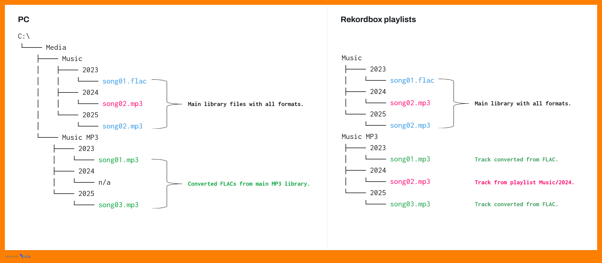

# Notice

MetaRekordFixer (hereinafter referred to as "the application") is an unofficial tool intended for personal use only and is not a product of AlphaTeta, the developer of rekordboxTM software. Use of the application is at the user`s own risk; the author assumes no responsibility for any potential damage (e.g., data loss or corruption) caused by using the application. As a precaution against possible negative consequences, a backup of the rekordboxTM software database, which the application accesses directly, is created before any user-requested and confirmed changes.

# Why Was This Application Created?

The author of the application is an active DJ who places great emphasis on correct metadata in his music collection, as it makes it easier to select songs during a performance. To fully utilize the features of Pioneer products, which are now standard in the DJ environment, the use of rekordboxTM software is almost a must. However, rekordboxTM has its limitations, especially when it comes to metadata. The author is not a programmer, so he initially created single-purpose Python scripts using freely available resources that were run from the command line. As the number of them grew, working with them became inconvenient. These scripts then served as the basis for a more comprehensive solution, the main goal of which is to function as a useful tool for **META**data in **REKORD**rdboxTM as a valuable **FIXER** and in a likeable graphical environment.

# What Does the Application Specifically Address?

The main shortcomings the author needed to solve were:

- [Notice](#notice)
- [Why Was This Application Created?](#why-was-this-application-created)
- [What Does the Application Specifically Address?](#what-does-the-application-specifically-address)
    - [1. Older Pioneer CDJ players do not support the FLAC format.](#1-older-pioneer-cdj-players-do-not-support-the-flac-format)
    - [2. Some metadata is not saved for FLAC files.](#2-some-metadata-is-not-saved-for-flac-files)
    - [3. Transfer of (HOT) CUEs and other information.](#3-transfer-of-hot-cues-and-other-information)
    - [4. Inability to change the track format.](#4-inability-to-change-the-track-format)
    - [5. CDJs do not allow sorting tracks by release date.](#5-cdjs-do-not-allow-sorting-tracks-by-release-date)
    - [6. Lack of format conversion.](#6-lack-of-format-conversion)
- [How the Application Works](#how-the-application-works)
- [Installation](#installation)
- [Final Information](#final-information)

### 1. Older Pioneer CDJ players do not support the FLAC format. ###

The author solved this by ensuring that every FLAC in his collection has an MP3 version stored separately from the main collection. The storage contains two main folders: `Music` (the main collection with FLAC and MP3) and `Music MP3` (a collection of MP3s created from the FLACs located in `Music`). This folder structure is mirrored. In rekordboxTM, there are two root folders: `Music` and `Music MP3`. `Music` contains playlists that match the folders in `Music`, and `Music` contains playlists based on the folders and contents in the storage, supplemented with MP3s from the main collection. Both folders can then be exported from rekordboxTM to portable storage (USB Flash, HDD, SSD, SD card), and if the DJ is using older CDJs, he select tracks from `Music MP3`. See a specific example below of the files and playlist structure for easier understanding.

### 2. Some metadata is not saved for FLAC files. ###

rekordboxTM doesn`t store metadata such as *release date, album artist, mix title,* and *original artist* for FLAC files, while it correctly saves these for MP3 files. MetaRekordFixer leverages this as follows:

- The basic assumption is that MP3 equivalents of the original FLAC tracks are imported into the rekordboxTM database in the same structure (see above).
- Metadata from these MP3s is copied into the database entries for the FLAC library items.

*Important note: MP3 and FLAC files must have the same filename (regardless of extension).*
  
### 3. Transfer of (HOT) CUEs and other information. ###

The DJ created a library containing MP3 copies of his FLAC tracks for compatibility with older CDJs. However, grid settings, hot cues, memory cues, and play counts are stored only with the FLACs. MetaRekordFixer copies this information to the appropriate tracks. It is possible to:

- Set data transfer between items by selecting source and target folders containing the files.
- Set data transfer between playlists, useful if tracks are in different folders.
- Combine both: source items from a folder, target items from a playlist, and vice versa.
Important note: If the source or target file is MP3, its bitrate must be constant. With variable bitrate, transferred CUE points may not be at the correct positions.

### 4. Inability to change the track format. ###

The author had some tracks in low-quality MP3. He obtained the same tracks in FLAC as replacements. Normally, tracks must be re-imported into rekordboxTM, which results in loss of CUE points, etc. MetaRekordFixer solves this: just prepare a playlist with the original tracks to be replaced and have the new tracks in a folder. The files must have the same name (regardless of extension).

### 5. CDJs do not allow sorting tracks by release date. ###

Pioneer CDJs can sort tracks by the date added to the rekordboxTM library. However, the author often needs tracks sorted by recency, and if he adds older tracks to his archive, they appear as new. MetaRekordFixer can change the date added for tracks and offers two options:

- Set the date added to match the release date stored in the rekordboxTM database (with the option to exclude tracks from specific folders).
- Set a specific date added for tracks in specific folders.

### 6. Lack of format conversion. ###

When adding FLAC tracks, the author also acquires MP3 equivalents. For convenience, MetaRekordFixer includes a simple converter for common audio formats with basic, default parameters. If the user wants the highest quality for the target track, nothing needs to be set-the default is maximum quality. Just set the source and target locations. It is also possible to create a folder with the same name as the source, ensuring the same directory structure.

# How the Application Works

The application uses direct access to the rekordboxTM database, which is usually located at `%appdata%/Roaming/Pioneer/rekordbox` under the filename `master.db`. This location must be specified in the Settings. Backups of this database are also stored here. Format conversion is performed using the external tools ffprobe and ffmpeg from the `/tools` folder in the application`s installation directory.

# Installation

Currently available for Windows only. The installer can be downloaded from [releases page](../../releases/latest); simply run it and follow the steps. Administrator rights are not required, as the application-including conversion tools-installs to `%appdata%/Local/Programs/MetaRekordFixer`. The application includes automatic language detection based on system settings; currently supported languages are English (default for unsupported languages), Czech, and German.

# Final Information

The application was created by a DJ without programming experience. It may therefore contain bugs or issues related to individual DJs` collection management habits. The development of the application continues, with new features and development of existing ones planned.
